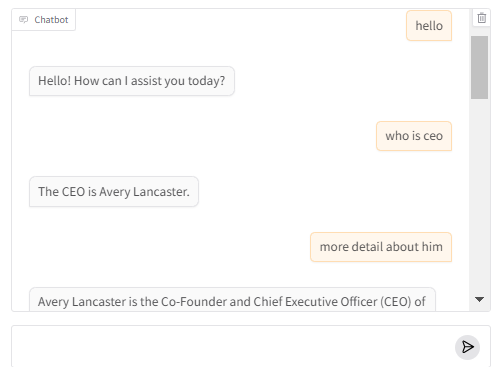

Here’s a revised version of the README that includes details on the project, visualization, and the requested image (`ragchat.png`):

---

# **Expert Knowledge Worker: RAG-based Interactive Chat with FAISS Vector Search**

### **Overview**
This project demonstrates the power of **Retrieval-Augmented Generation (RAG)** combined with **FAISS vector search** for creating an intelligent and interactive knowledge worker. The system allows users to search, interact, and retrieve information from a large knowledge base using semantic vector search, enhanced by a language model (GPT). The embeddings are visualized using **2D and 3D** plots for better understanding of the knowledge space, empowering the system with smarter retrieval capabilities.

This project utilizes **LangChain** to handle document loading, text splitting, vectorization, and interactive querying, while **FAISS** manages the storage and retrieval of vector embeddings.

---

### **Project Flow**
1. **Knowledge Base Loading:**
   - Text documents are loaded from multiple subfolders and processed using **LangChain’s DirectoryLoader** and **TextLoader**.
   
2. **Text Splitting:**
   - Documents are split into smaller chunks using **CharacterTextSplitter**, making it easier to handle and index specific sections of information.

3. **Embedding & Vectorization:**
   - Each document chunk is converted into a vector embedding using **OpenAIEmbeddings** and stored in a **FAISS vector store** for efficient retrieval.

4. **Dimensionality Reduction:**
   - **t-SNE** is used to reduce the high-dimensional embeddings into 2D and 3D spaces for visualization. This makes it easier to interpret the semantic relationships between the document chunks.

5. **RAG-based Search:**
   - The retrieval-augmented generation approach is used with **OpenAI's GPT model** to answer user queries based on the context of the vector store.
   
6. **Gradio Interface:**
   - A **Gradio** interface is implemented to provide a user-friendly chatbot experience for querying the knowledge base in real-time.

---

### **Visual Examples**

#### **2D Vector Visualization**
The following is a **2D visualization** of the FAISS vector store, where each point represents a document chunk, and the colors differentiate document types (products, employees, contracts, etc.):


#### **3D Vector Visualization**
Here’s a **3D visualization** of the same embedding space, allowing users to explore the vector relationships in three dimensions:


#### **RAG Chat Interface**
The system’s **RAG-powered chat interface** allows users to interact with the knowledge base. Below is an example of how the system answers a query in an interactive chat interface:


---

### **Key Features**
- **Document Loading and Preprocessing:** Automatically loads documents from specified directories, splits them into manageable chunks, and prepares them for vectorization.
- **Vector Store:** Uses **FAISS** to efficiently store and retrieve vector embeddings, which represent the semantic meaning of each chunk of text.
- **Dimensionality Reduction:** Reduces high-dimensional vectors to 2D and 3D for interactive visualization.
- **RAG for Smart Retrieval:** Combines **vector search** with **GPT-based generation** to provide accurate, context-aware answers to user queries.
- **Gradio Interface:** Provides an easy-to-use chat interface for interacting with the knowledge base in real time.

---

### **Getting Started**

#### **Prerequisites**
- Python 3.8 or later
- OpenAI API Key
- Install necessary Python libraries with the provided `requirements.txt`

#### **Installation**
1. Clone the repository:
   ```bash
   git clone <repository-url>
   ```
2. Navigate to the project folder:
   ```bash
   cd <project-folder>
   ```
3. Install dependencies:
   ```bash
   pip install -r requirements.txt
   ```

#### **Setup Environment**
Make sure you have your **OpenAI API key** set up in the `.env` file. Here’s an example:
```bash
OPENAI_API_KEY=<your-api-key>
```

---

### **How It Works**
1. **Document Loading:**
   - The script loads documents from the `knowledge-base` folder using LangChain's loaders.
   
2. **Text Splitting:**
   - Documents are split into chunks, and metadata about each chunk is stored (e.g., document type).
   
3. **FAISS Vector Store:**
   - The chunks are vectorized using OpenAI's embeddings and stored in a **FAISS** vector store for efficient search.
   
4. **Visualization:**
   - **t-SNE** is used to reduce the dimensionality of the vector space, and Plotly is used to create interactive 2D and 3D visualizations of the embeddings.
   
5. **RAG Chat:**
   - The system answers questions by combining the embeddings with a language model (GPT), retrieving relevant information from the vector store and generating responses.
   
6. **Gradio Interface:**
   - The **Gradio** interface allows users to input questions, interact with the knowledge base, and get real-time answers.

---

### **Example Query**
For example, if you ask the system:  
`"Can you describe Insurellm in a few sentences?"`  
It generates the following response:
> Insurellm is an innovative insurance tech startup founded by Avery Lancaster in 2015, aimed at disrupting the insurance industry with its range of software products. The company, which has grown to 200 employees and operates 12 offices across the US by 2024, offers four main products: Carllm for auto insurance, Homellm for home insurance, Rellm for the reinsurance sector, and Marketllm, a marketplace connecting consumers with insurance providers. With over 300 clients worldwide, Insurellm focuses on delivering reliable and transformative solutions in the insurance market.

---

### **Future Work**
- Add more advanced visualization techniques (e.g., t-SNE animation).
- Extend the project to support additional data types such as images and audio.
- Implement a more advanced user interface for managing and querying the knowledge base.

---

### **Contact**
For further questions or collaboration, please contact [Your Name/Your Team] at [Your Email/Contact Info].

--- 

This updated README focuses on the core functionalities of your project while including clear references to the **visualizations** and **RAG-based chat interface**. It integrates the images (`2DVIS.PNG`, `3DVIS.PNG`, and `ragchat.png`) as specified. Let me know if you need further modifications!
