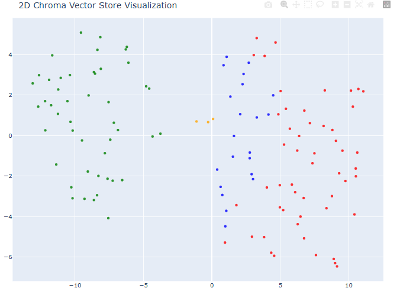
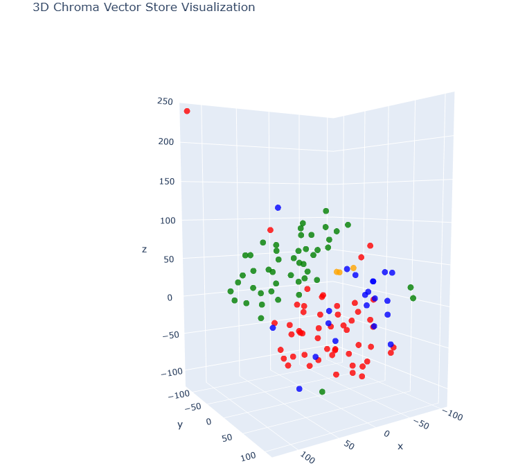

# **Interactive Visualization of Embeddings for Smarter Retrieval**

### **Overview**
This project is designed to visually demonstrate the power of vector embeddings in search and retrieval tasks. By transforming embeddings into intuitive **2D and 3D visualizations**, it helps users uncover patterns, clusters, and relationships within their data.

The focus is on **interactive exploration** and **improving retrieval systems** like **Retrieval-Augmented Generation (RAG)** by making complex embedding spaces accessible and interpretable.

---

### **Why Visualization Matters**
- **Understand Semantic Relationships:** Visualizing embeddings reveals how chunks of data relate to each other semantically.
- **Better Search Accuracy:** See how similar data points group together, leading to more precise retrieval results.
- **Enhanced Interpretability:** Go beyond numerical embeddings and explore their contextual meaning.

---

### **Visual Examples**

#### **2D Visualization**
The following image shows a **2D embedding space**, reduced from high dimensions:


#### **3D Visualization**
Here’s an interactive **3D visualization** of the same embedding space:


---

### **Key Features**
1. **Embedding Generation:**
   - Generate embeddings for document chunks using OpenAI’s API.
2. **Dimensionality Reduction:**
   - Use PCA or t-SNE for reducing embeddings into 2D or 3D spaces.
3. **Visualization:**
   - Leverage plotting libraries to visually explore embeddings.
4. **RAG-Enhanced Search:**
   - Use vector-based retrieval systems to improve search accuracy.
5. **Interactive Notebook:**
   - Experiment with embedding visualization and querying in a Jupyter notebook.

---

### **Getting Started**

#### **Prerequisites**
- Python 3.8 or later
- OpenAI API Key
- Libraries (install with `requirements.txt`)

#### **Installation**
1. Clone the repository:
   ```bash
   git clone <repository-url>
   ```
2. Navigate to the folder:
   ```bash
   cd <project-folder>
   ```
3. Install dependencies:
   ```bash
   pip install -r requirements.txt
   ```

#### **Environment Setup**
Create a `.env` file and set your OpenAI API key:
```bash
OPENAI_API_KEY=<your-api-key>
```

---

### **How It Works**

#### **Embedding Generation**
Chunks of text are encoded into vector embeddings, representing their semantic meaning in a high-dimensional space.

#### **Dimensionality Reduction**
The project reduces these embeddings to 2D or 3D to make them visually interpretable.

#### **Query Example:**
The notebook highlights the limitations of traditional keyword search using a sample query for "CEO."

```python
for chunk in chunks:
    if 'CEO' in chunk.page_content:
        print(chunk)
        print("_________")
```

- **Problem:** Text-based search often fails with synonyms or indirect references.
- **Solution:** Vector-based search retrieves contextually similar chunks and visualizes relationships.

---

### **Interactive Features**
- **Real-Time Visual Exploration:**
  - Generate 2D and 3D plots for embedding spaces.
  - Visualize clusters of similar document chunks.
- **Enhanced RAG Search:**
  - Improve retrieval accuracy with vector-based methods.
- **Contextual Insights:**
  - Use visualization to explain and validate retrieval results.

---

### **Future Work**
- Add a live visualization dashboard using Streamlit.
- Support multi-modal embeddings (e.g., for images and audio).
- Provide tutorials on embedding spaces for non-technical users.

---

